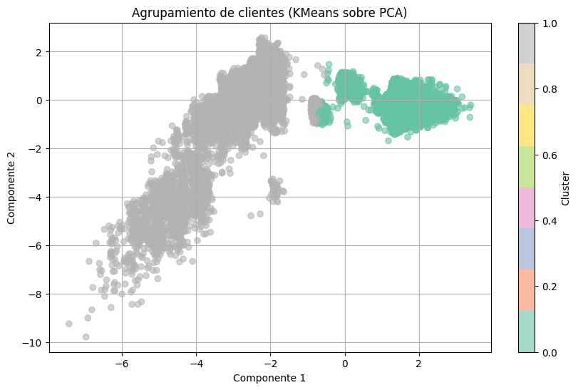

# 🧠 Predicción de Suscripción Bancaria y Agrupamiento de Clientes

Este proyecto aborda el problema de **predicción de suscripción a productos bancarios** a partir de datos de campañas de marketing telefónicas. Se aplica un enfoque integral que abarca desde el preprocesamiento de datos y reducción de dimensionalidad, hasta la selección del mejor modelo y su posterior puesta en producción. Además, se incluye un análisis no supervisado para **segmentación de clientes**.

---

## 📑 Índice

1. 📌 Objetivo del Proyecto
2. 🔎 Preprocesamiento de Datos
3. 📉 Agrupamiento de Clientes con KMeans sobre PCA
4. ⚙️ Selección de Modelos Iniciales
5. 📦 Reducción de Variables y Modelo en Producción
6. 📊 Comparativa de Modelos
7. 🧰 Tecnologías Utilizadas
8. ✅ Conclusión Final

---

## 🎯 Objetivo del Proyecto

El objetivo principal fue construir un modelo de clasificación capaz de predecir si un cliente aceptará una oferta de suscripción. Esto se realizó comparando múltiples algoritmos de Machine Learning, optimizando su rendimiento y evaluando su aplicabilidad en entornos productivos.

---

## 🧹 Preprocesamiento de Datos

Previo al modelado, los datos fueron sometidos a una limpieza y transformación exhaustiva:

| Tipo de Columna        | Técnica Aplicada                                               |
|------------------------|----------------------------------------------------------------|
| Numéricas continuas    | Escalado mediante `StandardScaler`                             |
| Categóricas (nominales)| Codificación One-Hot (`OneHotEncoder`)                        |

Se utilizó `ColumnTransformer` para aplicar distintas transformaciones a diferentes tipos de variables de forma eficiente y reproducible.

---

## 📉 Agrupamiento de Clientes con KMeans sobre PCA

Se aplicó el algoritmo **KMeans (2 clusters)** sobre el espacio generado por **PCA** con 2 componentes principales, para explorar **patrones de comportamiento y condiciones económicas** latentes en los clientes.

### 🧠 ¿Qué representan los ejes?

- **Componente 1** y **Componente 2** son combinaciones lineales de variables económicas como `euribor3m`, `emp.var.rate`, `nr.employed`, etc.
- Reflejan características macroeconómicas y demográficas de los clientes.

### 🔍 Interpretación de Clusters

- **Cluster 0**: Clientes en situaciones económicas más desfavorables.
- **Cluster 1**: Clientes en condiciones económicas más estables o favorables.

Este análisis no supervisado permite una segmentación valiosa para estrategias comerciales o como input para modelos supervisados.

---

## ⚙️ Selección de Modelos Iniciales

Los tres modelos seleccionados inicialmente fueron:

| Modelo             | Motivo de Selección                                                                 |
|--------------------|--------------------------------------------------------------------------------------|
| **LogisticRegression** | Baseline simple, interpretabilidad alta, buena en problemas lineales.             |
| **RandomForest**       | Modelo de ensamble robusto, maneja bien no linealidades y outliers.               |
| **XGBoost**            | Estado del arte en tabular data, optimiza métricas de clasificación y AUC.       |

Cada modelo fue entrenado tanto en su versión **completa** como en una versión **reducida** de solo tres variables.

---

## ✂️ Reducción de Variables y Modelo en Producción

Para desplegar el modelo en producción, se construyó una versión simplificada con solo **tres variables clave**:

- `age`
- `euribor3m`
- `campaign`

Estas columnas fueron seleccionadas por:

- Su alta correlación con la variable objetivo
- Su disponibilidad temprana en procesos de captación de clientes
- Su estabilidad y bajo ruido

Esta versión ofrece un **excelente trade-off entre rendimiento y simplicidad**, ideal para despliegues en tiempo real o aplicaciones web.

---

## 📊 Comparativa de Modelos

Se evaluaron las métricas de todos los modelos usando dos configuraciones: con todas las columnas y con solo tres columnas.

| Modelo           | Dataset     | Accuracy | Precision (1) | Recall (1) | F1 (1) | ROC AUC |
|------------------|-------------|----------|---------------|------------|--------|---------|
| Logistic Reg     | 3 col       | 0.73     | 0.25          | 0.73       | 0.38   | 0.7615  |
| Logistic Reg     | Full        | 0.84     | 0.37          | 0.65       | 0.47   | 0.8009  |
| Random Forest    | 3 col       | 0.84     | 0.38          | 0.64       | 0.47   | 0.7881  |
| Random Forest    | Full        | 0.86     | 0.42          | 0.63       | 0.50   | 0.8128  |
| XGBoost          | 3 col       | 0.87     | 0.44          | 0.59       | 0.50   | 0.7947  |
| **XGBoost**      | **Full**    | **0.88** | **0.48**      | **0.59**   | **0.53**| **0.8181** |

### 🏆 Modelo Seleccionado: XGBoost (Full)

Se seleccionó este modelo por:

- **Mayor F1-score** para la clase positiva (`y=1`)
- **Mayor ROC AUC**, lo que indica mejor desempeño global
- **Balance adecuado entre precisión y recall**, clave en contextos con clase minoritaria

---

## 🧰 Tecnologías Utilizadas

| Librería         | Funcionalidad Principal                                              |
|------------------|----------------------------------------------------------------------|
| `pandas`         | Manipulación y análisis de datos                                     |
| `numpy`          | Operaciones numéricas y soporte para estructuras matriciales         |
| `scikit-learn`   | Modelado, preprocesamiento, validación cruzada, métricas             |
| `xgboost`        | Algoritmo de gradient boosting optimizado                            |
| `matplotlib`, `seaborn` | Visualización de datos y resultados                            |
| `PCA` (de sklearn) | Reducción de dimensionalidad para análisis y agrupamiento           |
| `KMeans`         | Clustering no supervisado para segmentación de clientes              |

---

## ✅ Conclusión Final

- Se desarrolló un modelo robusto basado en **XGBoost con todas las variables**, el cual ofrece el mejor rendimiento en métricas clave.
- Se implementó también un modelo **reducido con 3 variables**, ideal para producción.
- El análisis PCA+KMeans permitió extraer información valiosa sobre la segmentación natural de los clientes.
- Este pipeline puede extenderse fácilmente para aplicaciones reales en banca o marketing.

---
